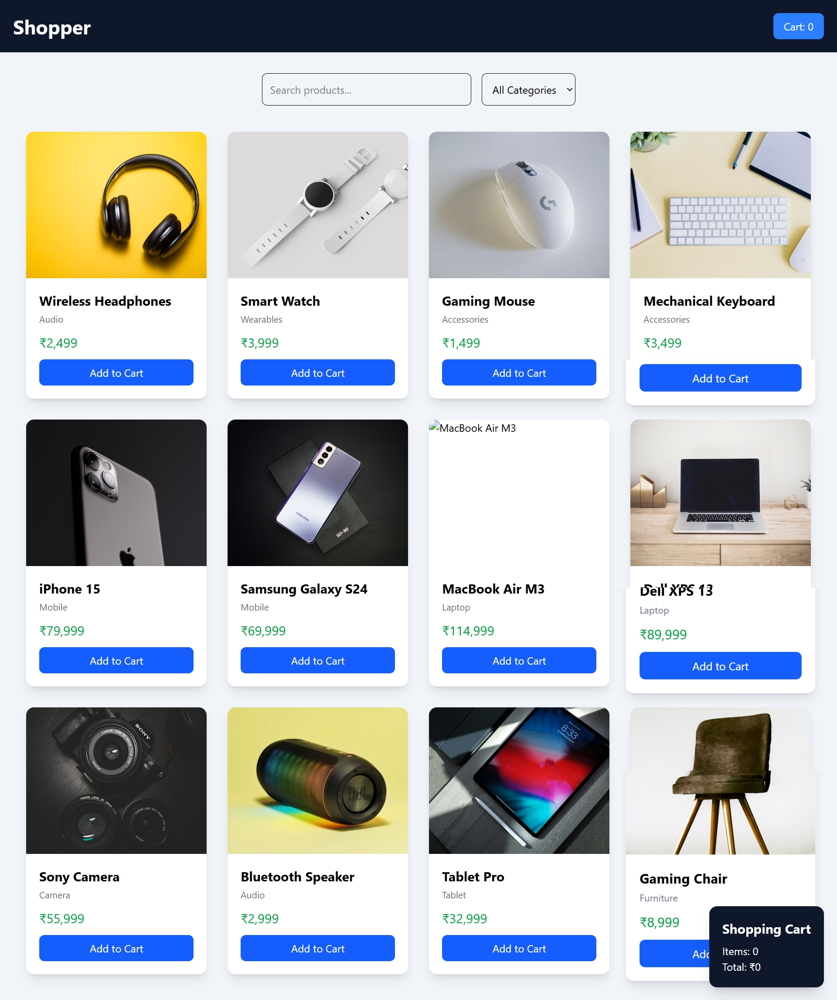

# 🛒 ShopEase - React E-Commerce Product Page
ShopEase is a simple and responsive e-commerce product page built using React and Tailwind CSS. The application allows users to browse products, search for items, filter products by category, and add products to a shopping cart. It provides a clean and modern user interface suitable for learning React state management and component-based development.

## Screeshot

## Live@
[live@](https://shopper-three-rho.vercel.app/)

## 🚀 Features

* Product listing with images, names, categories, and prices
* Search products by name
* Filter products by category
* Add products to shopping cart
* Real-time cart item count
* Automatic total price calculation
* Responsive design for mobile, tablet, and desktop screens
* Built using React Hooks and Tailwind CSS

## 🛠️ Technologies Used

* React
* JavaScript (ES6+)
* Tailwind CSS
* Vite
